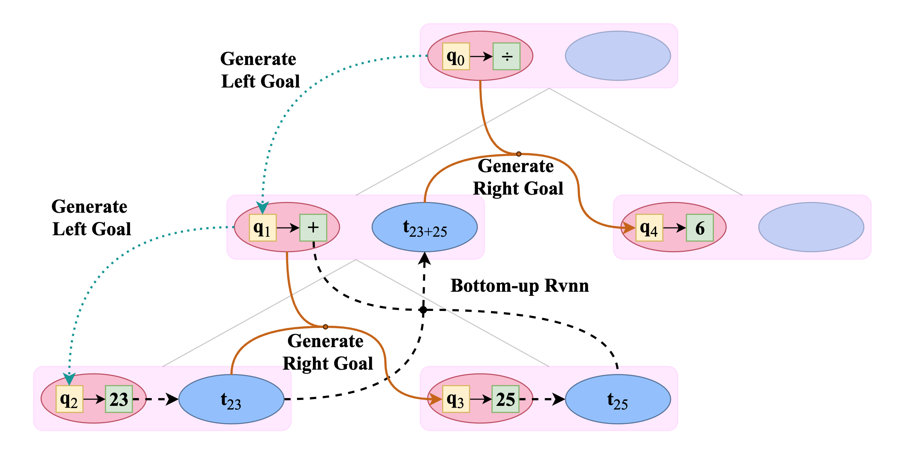

# A Goal-Driven Tree-Structured Neural Model for Math Word Problems

This repository is the [PyTorch](http://pytorch.org/) implementation for the IJCAI 2019 accepted paper:
> Zhipeng Xie* and Shichao Sun*,
> [A Goal-Driven Tree-Structured Neural Model for Math Word Problems](https://www.ijcai.org/proceedings/2019/0736.pdf)
> IJCAI 2019. 

\* indicates equal contribution.

## Seq2Tree Model
A Seq2Tree Neural Network containing top-down Recursive Neural Network and bottom-up Recursive Neural Network




## Requirements
- python 3
- [PyTorch](http://pytorch.org/) 0.4.1


## Train and Test

- Math23K: 
```
python3 run_seq2tree.py
```

## Results

| Model | Accuracy | 
|--------|--------|
|Hybrid model w/ SNI | 64.7% | 
|Ensemble model w/ EN | 68.4% | 
|Seq2Tree w/o Bottom-up RvNN | 70.0% | 
|Seq2Tree| **74.3%** | 


## Citation
    @inproceedings{ijcai2019-736,
      title     = {A Goal-Driven Tree-Structured Neural Model for Math Word Problems},
      author    = {Xie, Zhipeng and Sun, Shichao},
      booktitle = {Proceedings of the Twenty-Eighth International Joint Conference on
                   Artificial Intelligence, {IJCAI-19}},
      publisher = {International Joint Conferences on Artificial Intelligence Organization},             
      pages     = {5299--5305},
      year      = {2019},
      month     = {7},
      doi       = {10.24963/ijcai.2019/736},
      url       = {https://doi.org/10.24963/ijcai.2019/736},
    }

